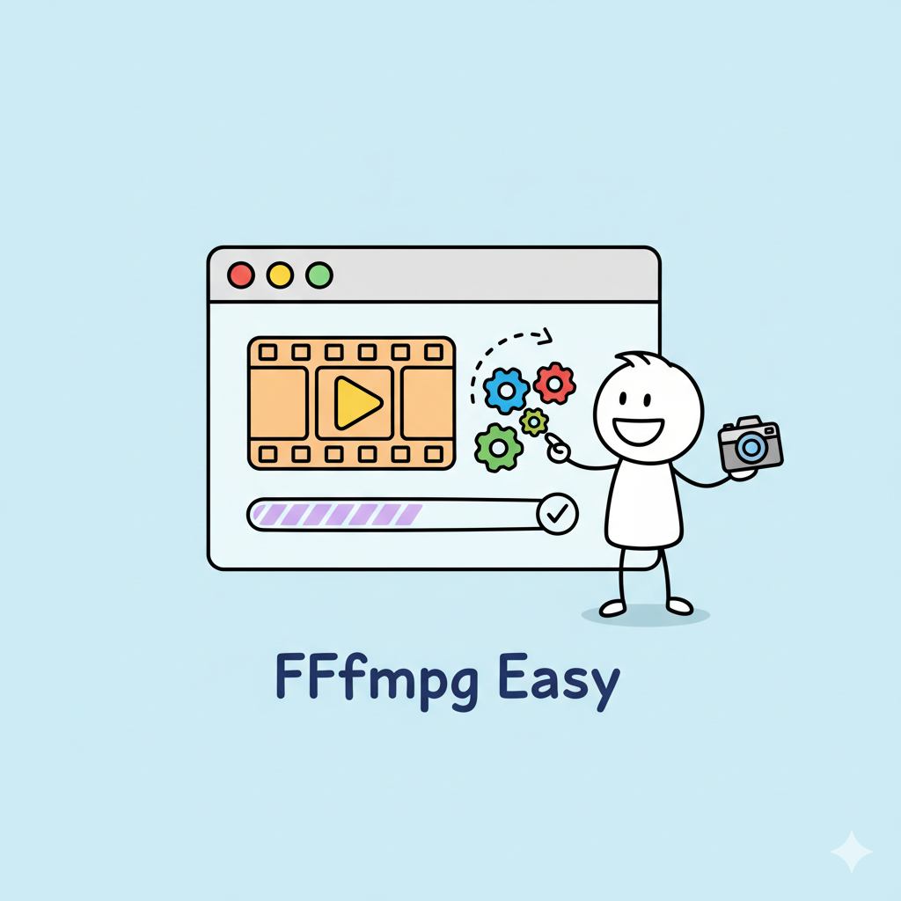
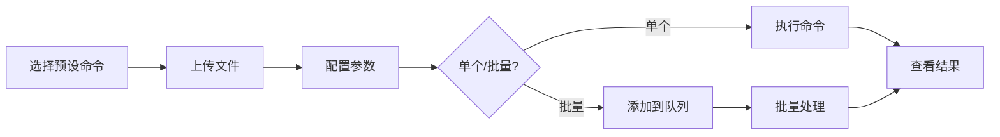

<div align="center">
  
  
  # FFmpeg Easy
  
  ### 🎬 浏览器中的专业视频处理工具
  
  基于 React Router v7 和 FFmpeg.wasm 构建 · 完全本地处理 · 隐私优先
  
  [](https://opensource.org/licenses/MIT)
  [](https://reactrouter.com/)
  [](https://www.typescriptlang.org/)
  [](https://github.com/ffmpegwasm/ffmpeg.wasm)
  
  [在线体验](https://ffmpeg-easy.vercel.app) · [功能文档](./docs/user-guide/FFMPEG_WEB.md) · [开发指南](./docs/dev-guide/README.md)
</div>

---

## ✨ 核心特性

<table>
<tr>
<td width="33%" valign="top">

### 🎯 **智能命令管理**
- 📦 10+ 内置预设命令
- ✏️ 可视化表单编辑器
- 🔄 CLI 命令导入导出
- 💾 自动持久化存储
- 🏷️ 分类标签管理

</td>
<td width="33%" valign="top">

### ⚡ **批量任务处理**
- 🚀 并发执行（1-4 线程）
- 📊 实时进度追踪
- 🎬 结果即时预览
- 💿 IndexedDB 历史记录
- 🔁 一键重新执行

</td>
<td width="33%" valign="top">

### � **隐私与性能**
- 🏠 100% 本地处理
- ⚡ WebAssembly 加速
- 🧵 多线程支持
- 📱 响应式设计
- 🎨 现代 UI 体验

</td>
</tr>
</table>

### 🌟 亮点功能

- **🎨 自定义表单**: 基于 JSON Schema 的可视化参数配置，无需记忆 FFmpeg 命令
- **📝 智能日志**: 实时日志流、搜索过滤、自动滚动、一键清空
- **🎯 文件名标准化**: 自动处理中文、空格、特殊字符，避免 FFmpeg 错误
- **💡 新手引导**: Driver.js 交互式教程，快速上手所有功能
- **🌐 CDN 智能选择**: 自动检测最快 CDN，支持自定义源
- **📦 零配置部署**: 支持 10+ 部署平台，开箱即用

## 🎯 使用场景

| 场景 | 说明 | 推荐命令 |
|------|------|----------|
| 📱 **社交媒体** | 快速转换视频格式 | 转换为 WebM, 压缩视频 |
| 🎬 **视频剪辑** | 提取片段和音频 | 提取视频片段, 提取音频为 MP3 |
| 🖼️ **动图制作** | 视频转 GIF | 转换为 GIF |
| 🔄 **格式转换** | 批量转换格式 | 复制流（快速无损）|
| 📐 **尺寸调整** | 调整分辨率 | 视频缩放（自定义）|
| 🎥 **视频合并** | 拼接多个视频 | 合并视频 |

## 🚀 快速开始

### 📦 本地开发

```bash
# 克隆仓库
git clone https://github.com/KiritoKing/yet-another-ffmpeg-webui.git
cd yet-another-ffmpeg-webui

# 安装依赖（推荐使用 pnpm）
pnpm install

# 启动开发服务器
pnpm dev
```

访问 `http://localhost:5173` 即可开始使用 🎉

### 🐳 Docker 快速部署

```bash
# 使用 Docker Compose（推荐）
docker-compose up -d

# 或者构建并运行
docker build -t ffmpeg-easy .
docker run -p 3000:3000 ffmpeg-easy
```

### ☁️ 一键部署

<div align="center">
  
  [](https://vercel.com/new/clone?repository-url=https://github.com/KiritoKing/yet-another-ffmpeg-webui)
  [](https://app.netlify.com/start/deploy?repository=https://github.com/KiritoKing/yet-another-ffmpeg-webui)
  [](https://railway.app/new/template?template=https://github.com/KiritoKing/yet-another-ffmpeg-webui)
  
</div>

## 📖 使用指南

### 💡 基础工作流



### 🎬 三大功能面板

| 面板 | 功能 | 适用场景 |
|------|------|----------|
| **⚡ 执行面板** | 快速处理单个文件 | 测试命令、快速转换 |
| **📋 队列面板** | 批量处理多个任务 | 批量转换、并发执行 |
| **📜 历史面板** | 查看和管理历史 | 重新执行、结果管理 |

### 🎯 快速操作指南

<details>
<summary><b>🔰 新手入门</b></summary>

1. **首次访问**: 选择运行模式（推荐多线程）
2. **选择命令**: 从左侧列表选择"复制流"
3. **上传文件**: 点击上传区域，选择视频文件
4. **执行**: 点击"执行命令"按钮
5. **下载**: 等待完成后下载结果

💡 提示：首次使用会自动显示交互式新手引导！
</details>

<details>
<summary><b>⚡ 批量处理</b></summary>

1. 选择要批量处理的命令
2. 点击"批量上传"，选择多个文件
3. 所有文件自动添加到队列
4. 切换到"队列"标签页
5. 设置并发数（1-4），点击"开始处理"
6. 实时查看每个任务的进度
7. 完成后可预览或下载所有结果

💡 提示：文件名会自动标准化，避免特殊字符问题！
</details>

<details>
<summary><b>🎨 自定义命令</b></summary>

1. 点击"+ 新建命令"
2. 填写基本信息（名称、描述、分类）
3. 配置 FFmpeg 参数
4. 可选：添加自定义表单字段
5. 保存后即可在列表中使用

💡 提示：查看"旋转视频"和"视频缩放"示例学习表单配置！
</details>

## 🛠️ 技术栈

<table>
<tr>
<td align="center" width="96">
  
  <br>React 19
</td>
<td align="center" width="96">
  
  <br>TypeScript
</td>
<td align="center" width="96">
  
  <br>Vite 7
</td>
<td align="center" width="96">
  
  <br>Tailwind v4
</td>
<td align="center" width="96">
  
  <br>Docker
</td>
</tr>
</table>

### 核心依赖

- **🎯 框架**: React 19 + React Router v7
- **💾 状态管理**: Zustand v5 (persist 中间件)
- **🎨 UI**: shadcn/ui + Radix UI + Lucide Icons
- **⚡ 核心**: FFmpeg.wasm v0.12.15 (单/多线程)
- **🔧 工具**: ahooks, dexie (IndexedDB), driver.js (引导)

## 📁 项目结构

```
ffmpeg-easy/
├── app/
│   ├── components/          # 🎨 UI 组件
│   │   ├── ui/             # shadcn/ui 基础组件
│   │   ├── CommandPanel.tsx    # 命令列表面板
│   │   ├── ExecutionPanel.tsx  # 执行控制面板
│   │   ├── QueueControlPanel.tsx   # 队列管理面板
│   │   └── TaskHistoryViewer.tsx  # 历史记录查看器
│   ├── hooks/              # 🎣 自定义 Hooks
│   │   ├── useFFmpegWeb.ts     # FFmpeg 业务逻辑
│   │   ├── useTaskManager.ts   # 任务队列管理
│   │   └── useOnboarding.ts    # 新手引导
│   ├── services/           # ⚙️ 业务服务
│   │   ├── ffmpegService.ts    # FFmpeg 核心封装
│   │   ├── queueProcessor.ts   # 队列处理器
│   │   ├── taskDatabase.ts     # IndexedDB 持久化
│   │   └── cdnService.ts       # CDN 健康检查
│   ├── store/              # 💾 状态管理 (Zustand)
│   │   ├── command/        # 命令预设状态
│   │   ├── task/           # 任务队列状态
│   │   ├── cdn/            # CDN 配置状态
│   │   └── log/            # 日志状态
│   └── utils/              # 🔧 工具函数
│       ├── parsers.ts          # CLI 解析
│       ├── validators.ts       # 参数验证
│       ├── templates.ts        # 模板处理
│       └── errorHandling.ts    # 错误处理
├── docs/                   # 📚 完整文档
│   ├── user-guide/        # 用户指南
│   ├── dev-guide/         # 开发者指南
│   └── changelog/         # 变更日志
└── public/                 # 📦 静态资源
```

## 📚 完整文档

| 文档 | 说明 |
|------|------|
| 📘 [用户指南](./docs/user-guide/) | 功能介绍、使用教程、FAQ |
| 🔧 [开发指南](./docs/dev-guide/) | 架构设计、API 文档、部署指南 |
| 📝 [变更日志](./docs/changelog/) | 版本历史、功能更新 |
| 🤖 [AI 协作指南](./AGENTS.md) | AI 开发辅助文档 |

## 🎬 预设命令示例

<table>
<tr><th>基础操作</th><th>格式转换</th><th>高级功能</th></tr>
<tr>
<td>

- ⚡ 复制流（快速）
- 🎵 提取音频
- ✂️ 提取片段
- 🔄 合并视频

</td>
<td>

- 🎞️ 转换为 WebM
- 🖼️ 转换为 GIF
- 🗜️ 压缩视频
- 📐 调整分辨率

</td>
<td>

- ⭐ 旋转视频（表单）
- ⭐ 自定义缩放（表单）
- 更多自定义命令...

</td>
</tr>
</table>

> ⭐ 标记的命令支持可视化表单配置，详见 [自定义表单文档](./docs/user-guide/CUSTOM_FORMS.md)

## � 部署指南

### 支持的平台

<table>
<tr>
<td align="center">

**⚡ Vercel**<br>
零配置部署<br>
✅ 推荐

</td>
<td align="center">

**🌐 Netlify**<br>
自动 CI/CD<br>
✅ 推荐

</td>
<td align="center">

**☁️ Cloudflare**<br>
全球 CDN<br>
✅ 企业级

</td>
<td align="center">

**🐳 Docker**<br>
完全控制<br>
✅ 自托管

</td>
</tr>
</table>

### 关键配置

所有平台均已预配置：
- ✅ **SharedArrayBuffer** 支持（COOP/COEP 头）
- ✅ **SPA 路由** 重定向
- ✅ **pnpm** 支持
- ✅ **Node 20** 环境

详细部署说明：[DEPLOYMENT.md](./docs/dev-guide/DEPLOYMENT.md)

详细部署说明：[DEPLOYMENT.md](./docs/dev-guide/DEPLOYMENT.md)

## ⚠️ 重要提示

### 💻 浏览器兼容性

| 浏览器 | 单线程 | 多线程 | 最低版本 |
|--------|--------|--------|----------|
| Chrome/Edge | ✅ | ✅ | 90+ |
| Firefox | ✅ | ✅ | 90+ |
| Safari | ✅ | ✅ | 15.2+ |
| IE | ❌ | ❌ | 不支持 |

### 📋 使用限制

- **文件大小**: 建议 < 500MB（浏览器内存限制）
- **并发任务**: 支持 1-4 个同时执行
- **文件格式**: 支持所有 FFmpeg 支持的格式
- **性能优化**: 使用 `-c copy` 模式可大幅提升速度

### 🔐 隐私保护

- ✅ **100% 本地处理** - 文件永不上传
- ✅ **无服务器依赖** - 静态部署即可
- ✅ **浏览器端加密** - 敏感内容完全安全
- ✅ **开源透明** - 代码完全可审计

## 🤝 贡献指南

欢迎各种形式的贡献！

### 如何贡献

1. 🍴 Fork 本仓库
2. 🔧 创建特性分支 (`git checkout -b feature/AmazingFeature`)
3. 💾 提交更改 (`git commit -m 'Add some AmazingFeature'`)
4. 📤 推送到分支 (`git push origin feature/AmazingFeature`)
5. 🎉 开启 Pull Request

### 开发规范

- ✅ TypeScript 严格模式
- ✅ 遵循现有代码风格
- ✅ 编写清晰的提交信息
- ✅ 更新相关文档

## 📄 开源协议

本项目采用 [MIT 协议](./LICENSE) 开源。

## 🙏 致谢

<table>
<tr>
<td align="center" width="20%">

**FFmpeg.wasm**<br>
WebAssembly FFmpeg

</td>
<td align="center" width="20%">

**React Router**<br>
现代路由框架

</td>
<td align="center" width="20%">

**shadcn/ui**<br>
精美组件库

</td>
<td align="center" width="20%">

**Zustand**<br>
状态管理

</td>
<td align="center" width="20%">

**TailwindCSS**<br>
CSS 框架

</td>
</tr>
</table>

特别感谢所有贡献者和支持者！⭐

---

<div align="center">
  
  **Built with ❤️ using React Router and FFmpeg.wasm**
  
  [⬆ 回到顶部](#ffmpeg-easy)
  
</div>

